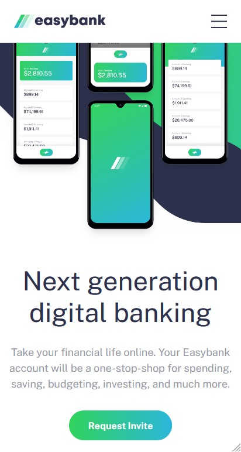
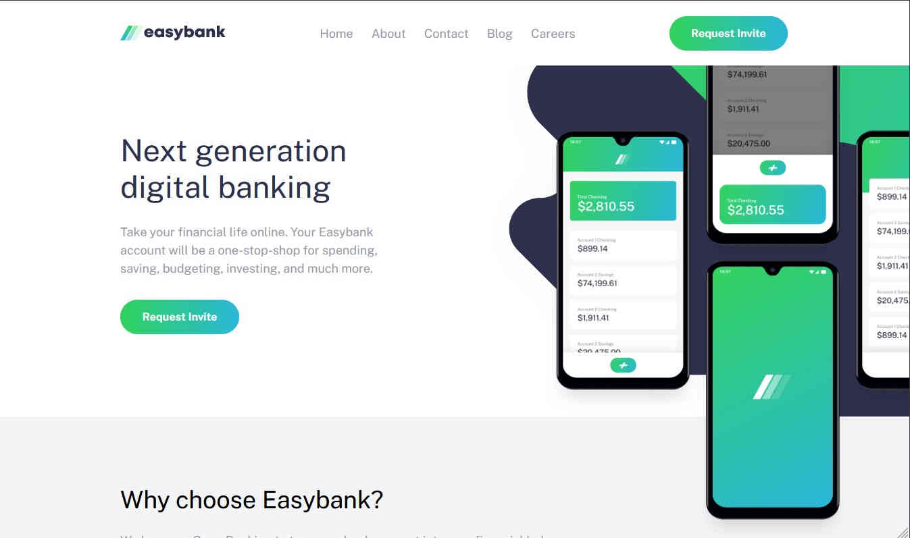
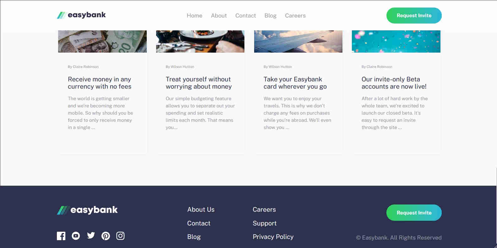

# Frontend Mentor - Easybank landing page solution

This is a solution to the [Easybank landing page challenge on Frontend Mentor](https://www.frontendmentor.io/challenges/easybank-landing-page-WaUhkoDN). Frontend Mentor challenges help you improve your coding skills by building realistic projects.

## Table of contents

- [Overview](#overview)
  - [The challenge](#the-challenge)
  - [Screenshot](#screenshot)
  - [Links](#links)
- [My process](#my-process)
  - [Built with](#built-with)
  - [What I learned](#what-i-learned)
  - [Continued development](#continued-development)
  - [Useful resources](#useful-resources)
- [Author](#author)
- [Acknowledgments](#acknowledgments)

## Overview

### The challenge

Users should be able to:

- View the optimal layout for the site depending on their device's screen size
- See hover states for all interactive elements on the page

### Screenshot





### Links

- Solution URL: [github.com/AndyCatlow/FEMeasybank](https://github.com/AndyCatlow/FEMeasybank)
- Live Site URL: [easybanklandingfem.netlify.app](https://easybanklandingfem.netlify.app)

## My process

### Built with

- Semantic HTML5 markup
- CSS custom properties
- Flexbox
- Mobile-first workflow

### What I learned

I decided to improve the expandability of the articles section by drawing the data from a local json file which could easily be replaced by an external fetch request. This is then rendered using vanilla javascript.

During this challenge I learnt how to simulate an animated gradient effect on the cta button. I achieved this by having two pseudo elements with different gradients moving behind a transparent button with the overflow hidden. The code can be seen below.

 

```css
.cta {
  display: block;
  width: max-content;
  color: var(--clr-very-light-gray);
  padding: 1em 2em;
  border-radius: 100vh;
  font-weight: bold;
  font-size: 0.9rem;
  background-color: transparent;
  position: relative;
  overflow: hidden;
  isolation: isolate;
}
.cta::before {
  content: "";
  position: absolute;
  z-index: -1;
  inset: 0;
  background: linear-gradient(
    90deg,
    var(--clr-lime-green),
    var(--clr-bright-cyan)
  );
}

.cta::after {
  content: "";
  position: absolute;
  z-index: -1;
  inset: 0;
  background: linear-gradient(
    90deg,
    var(--clr-bright-cyan),
    var(--clr-dark-blue)
  );
  transform: translateX(99%);
}

.cta::before,
.cta::after {
  transition: 300ms ease-in-out 200ms;
}

.cta:hover::before,
.cta:focus::before {
  transform: translateX(-99%);
}
.cta:hover::after,
.cta:focus::after {
  transform: translateX(0%);
}
```

### Continued development

The handling of the mockups image still bothers me as it doesn't play nicely when resizing the browser. This is only really an issue in unusual window proportions though.

### Useful resources

## Author

- Website - [Andy Catlow](https://www.andycatlow.dev)
- Frontend Mentor - [@AndyCatlow](https://www.frontendmentor.io/profile/AndyCatlow)
- Twitter - [@CatlowAndy](https://www.twitter.com/CatlowAndy)

## Acknowledgments

Thanks to Frontend Mentor for these lovely designs to practice with.
